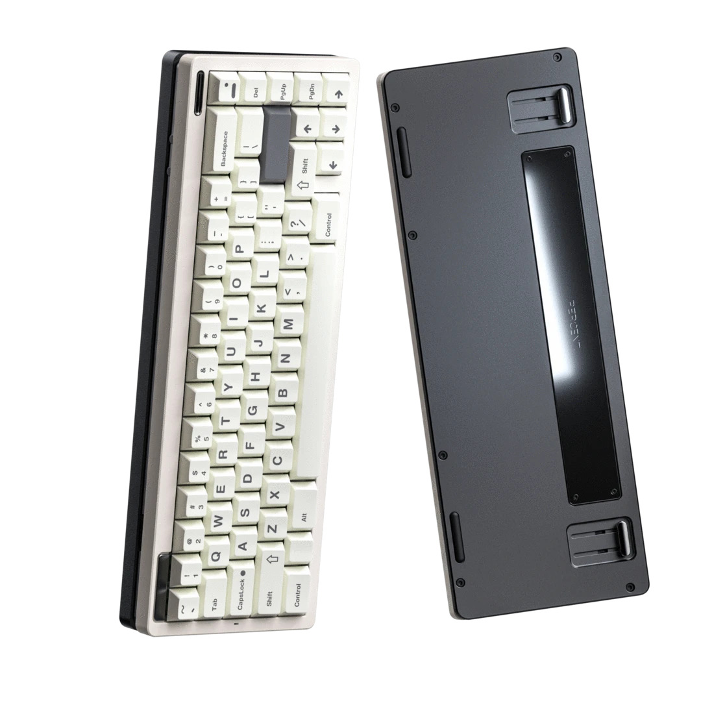

# Matroid
This repo includes keyboard firmware code to largely enhance QMK-based customized keyboards and GUI software to manage them. The configuration is very personal but the code can easily be reused for those who are familiar with QMK. All code is designed to work on MacOS, Linux and Windows without modification. But some implementation is still on the way. This is an ongoing project out of pure interest. I am also planning to work on keyboard hardware in the future. The goal would be split keyboards.
# Features
1. The keymap is optimized based on Colemak to support fast typing for programming. The location of most common symbols for programming are placed closer to the center. The symbols are actually sharing keys with letters with support from two additional modifiers.
2. It includes multiple layers to handle different situations, for example, a layer that works almost the same as Vim in its normal mode and a layer that is for TypeRacer only.
3. The keyboard will constantly communicate with the OS to perform more user-friendly operations. For example, the keyboard will behave differently based on the current focused application. The OS will also change its state, for example, switching the input source, based on the current layer.
4. It also have some details to help improve typing. For example, some keys will be disabled based on the position of the previously pressed modifier key to guide the user to efficiently use both hands. For a keyboard with a split spacebar, one of the space key may be disabled.
##
# Structure
## keyboard/*/keymap.c
This code implements different keymaps for each keyboard as they may vary in the number and layout of keys. They are all using Colemak layout.
## keyboard/common/matroid.h
This code implements Vim-like operations in the keyboard firmware. It also accepts various commands from the computer via a USB connection, which enables keyboard configuration on the computer.
## keyboard/install.h
This code compiles and installs the firmware, handling all details.
## computer/computer.py
This code implements a GUI keyboard manager using PyQt.
## computer/install.h
This code installs the keyboard manager, handling all details.
# My Favourite Keyboards
## New Poker

There are several versions of Poker. My one is New Poker and the picture above is New Poker II. The New Poker seems to have the most freedom in customizing the keymap. However, I replaced its PCB with a DZ60 with QMK support in the end.
## Matrix Noah

I am very lucky to have a Matrix Noah with an old version of PCB which supports split spacebar. I tried different keymaps to make my thumbs more useful in typing with split spacebar, although I am not sure if they actually worked. I am showing a white one but I have a black one.
## Canoe Gen2

I am still waiting for the shipment. It's hard to modify it for a split spacebar, which is the reason I am not using split spacebars for other functions anymore.
